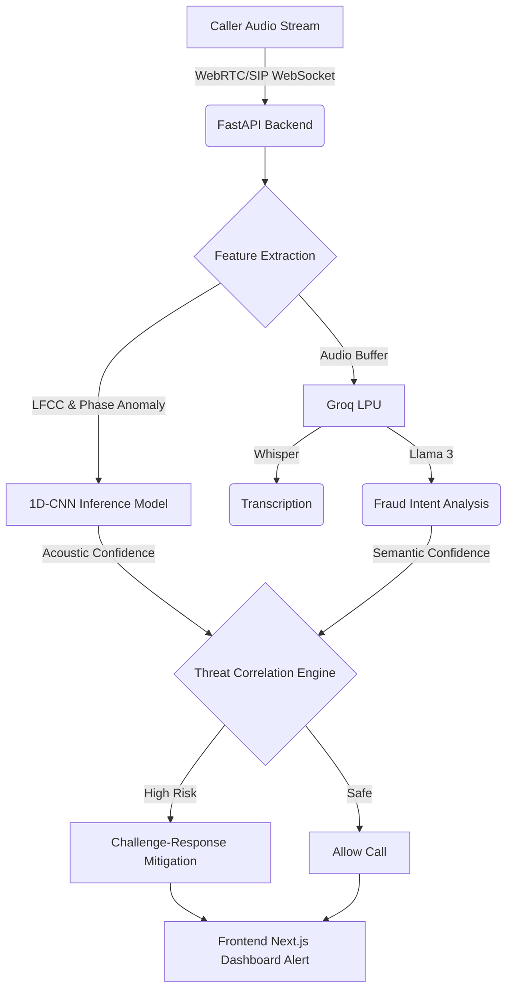

# V-SHIELD: AI-Powered Real-Time Voice Cloning Detection & Prevention
**Smart India Hackathon 2026 | Problem Statement ID: SIH26104**  
**Category:** Software | **Theme:** Blockchain & Cybersecurity  
**Organization:** All India Council for Technical Education (AICTE – Cyber Security Cell)


---

## 🎥 Live Demo

*(Insert 1-minute demo video or GIF showing the real-time detection dashboard here)*

<p align="center">
  
</p>

## 📌 Executive Summary
V-SHIELD is a real-time security framework designed to intercept telephonic, VoIP, and WebRTC audio streams to identify AI-generated voice cloning attacks within 280ms. Combining local digital signal processing (LFCC + phase anomaly analysis) with Groq LPU inference, V-SHIELD detects synthetic speech and executes proactive challenge-response verification before fraudulent transactions take place.

## 🚀 Key Features
- **Sub-300ms Streaming Latency:** Evaluates 250ms sliding audio frames via lightweight quantized models.
- **Telephony Codec Adaptation:** Robust against 8 kHz narrowband compression (G.711 / AMR).
- **Multi-Modal Threat Correlation:** Combines acoustic vocoder detection with Groq Whisper transcription and Llama 3 semantic fraud intent tagging.
- **Active Interactive Mitigation:** Generates dynamic phonemic challenges when audio enters suspicious risk thresholds.
- **Zero-Knowledge Privacy:** Compliant with India's DPDP Act 2023 using ephemeral in-memory processing.

## 🛠️ Architecture Pipeline



## 💻 Quick Start

### 1. Backend Setup
```bash
cd apps/api
python3 -m venv .venv
source .venv/bin/activate
pip install -r requirements.txt
# Add your GROQ_API_KEY to apps/api/.env
uvicorn app.main:app --reload --port 8000
```

### 2. Frontend Setup
```bash
npm install
npm run dev
# Add your NEXT_PUBLIC_SUPABASE_URL and KEY to .env.local
```
